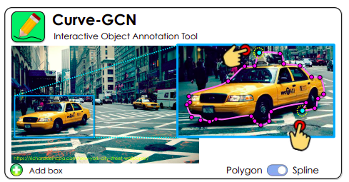
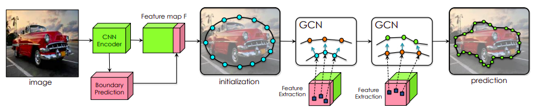
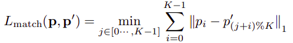
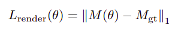
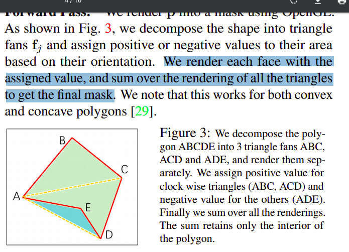

# Fast Interactive Object Annotation with Curve-GCN（cvpr2019）

*Paper*： https://arxiv.org/pdf/1903.06874.pdf

*Github*：https://github.com/fidler-lab/curve-gcn

### 问题和目的：人类给目标实例分割的标注是非常耗时耗力的，希望通过网络的方式来标注或辅助标注。

图1 用少量点击可以生成完全的轮廓

### Related Work

- **pixel-wise methods** 通过手动的标出目标box，然后通过不断的进行涂鸦来完全分割前景和背景，这类方法通常在前景和背景比较混淆的时候需要耗费很多次点击
- **contour-based methods** 就是直接预测轮廓，比较好的方法是 **Polygon-RNN**（逐个顶点预测） ，但RNN受限于速度和轮廓顶点的个数，这篇文章就是基于 **Polygon-RNN**，但把问题定义成回归问题，而不是逐个顶点预测。

### Method

图2 框架图

### Loss

**Point Matching Loss** 

这个损失可以保证预测点的顺序

**Differentiable Accuracy Loss** 

M表示的是mask，得到mask的方式如下

### Experiment

略

优点：速度快，利用了GCN

缺点：

