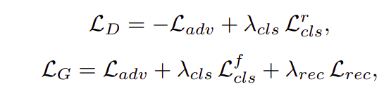

# Image-to-Image Translation: A Survey

___

### CycleGAN

---

### Unsupervised Image-to-Image Translation Networks

### (UNIT)

### 评估

1、 map dataset

2、Domain Adaption

---

### BicycleGAN

### 评估

---

### StarGAN

### 评估

---

### Multimodal Unsupervised Image-to-Image Translation

### （MUNIT）

### 评估

1、AMT

2、LPIPS Distance

3、(Conditional) Inception Score

---

### Latent Filter Scaling for Multimodal Unsupervised Image-to-Image Translation

### StyleGAN

---

### Few-Shot Unsupervised Image-to-Image Translation

---

### 总结：

