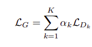
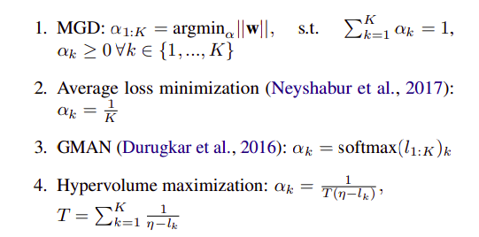
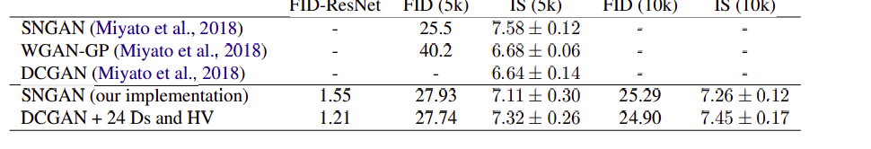

# Multi-objective training of Generative Adversarial Networks with multiple discriminators

### 1、使用多判别器，每个判别器都有一个目标函数，则应该使用多重梯度下降算法， MGD

### 2、如果使用MGD，对于神经网络消耗太大，使用代替方法，最大化由损失函数上界，中心点，以及每一种成分损失组成的

### 想法就是找到每个判别器损失的共同下降方向

### hypervolume

<u>*hypervolume：超立方体*</u>

### 贡献：1、提出多判别器的观点，2、提出新训练方法

### 多判别器方法可以总结为：

### 实验并没有特别出众的效果

