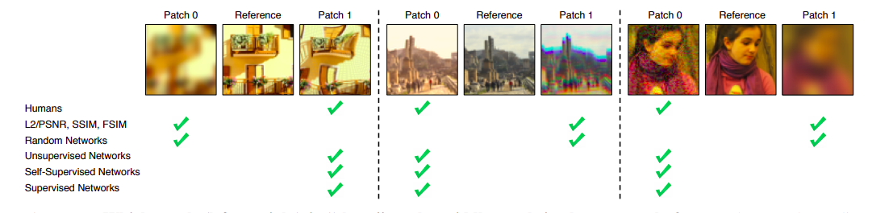

# The Unreasonable Effectiveness of Deep Features as a Perceptual Metric

图1 左右两边哪一个patch更接近中间的图片

### 目的：解决目前公式化衡量指标与人类感知不一致的问题

### 问题：验证常用的perceptual loss是否只能在imagenet上，是否和网络结构有关

### 贡献：提出了自己的数据集

