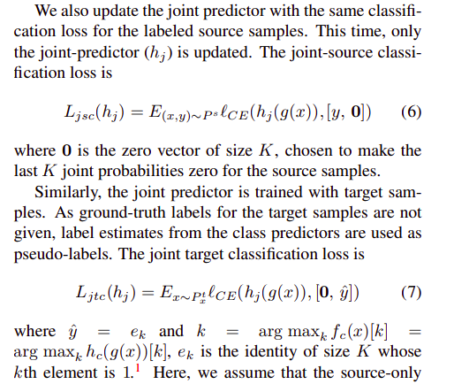

# Unsupervised Domain Adaptation via Regularized Conditional Alignment

图1 一张图片通过一个encoder，分成两个分支，一个是类别预测，另一个是联合预测

### 目的：在source domain训练，能工作在target domain

### 通用方法是对齐边缘分布$P(y_s)=P(y_t)$，但会出现source的猫与target的狗对齐的情况，所以需要对齐$P(y_s|x_s)=P(y_t|x_t)$或者$P(y_s,x_s)=P(y_t,x_t)$。

### 对齐边缘分布的方法是

图2 通过对抗训练

$min_{G_f}max_{G_d}V(G_f,G_d)= E_{source}[logG_d(F_{source})] + E_{target}[1-logG_d(G_f(F_{target}))]$

这样F_source和F_target就对齐了

### 为了结局对齐边缘分布带来的问题，作者提出了2k-way的对抗损失，认为有2k个类别，前k个为tager类，后k个为source类

### SSL：

决策边界应当是密度小的区域，

这个损失是使熵最小，即可以使边界朝着样本点少的地区移动

要满足litchiz条件